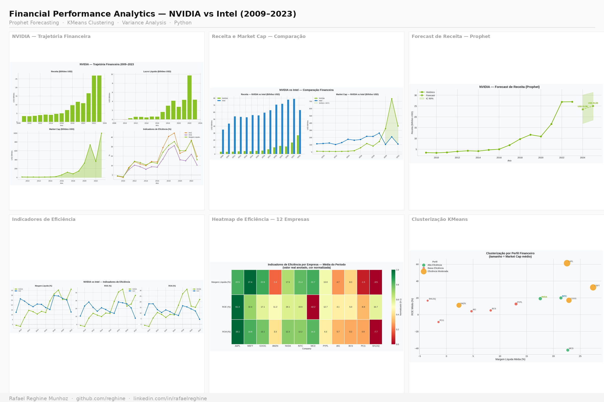
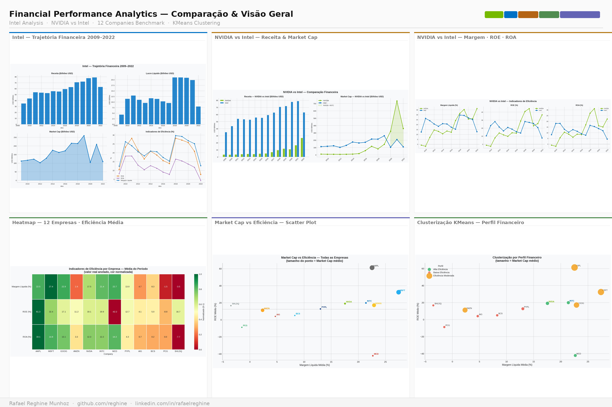

# Financial Performance Analytics — NVIDIA vs Intel


Análise comparativa de performance financeira entre NVIDIA e Intel ao longo de 15 anos, combinando FP&A tradicional com Machine Learning — Forecasting com Prophet, Clusterização com KMeans e Variance Analysis.

---

## Preview

### Dashboard Principal


### Comparação e Visão Geral


---

## Contexto de Negócio

Em 2009, a Intel era 11x maior que a NVIDIA em valor de mercado e dominava o setor de semicondutores.
Em 2023, a NVIDIA atingiu US$ 1 trilhão em Market Cap — enquanto a Intel permanecia estagnada nos mesmos US$ 109B de 2009.

**Pergunta central:** O que os dados financeiros revelam sobre essa transformação? Quais indicadores anteciparam a inversão de liderança?

---

## Dataset

**Financial Statements of Major Companies (2009–2023) — Kaggle**

- 12 empresas reais — Apple, Microsoft, Google, Amazon, NVIDIA, Intel e outras
- 15 anos de dados históricos (2009–2023)
- 23 indicadores financeiros — Revenue, Net Income, EBITDA, ROE, ROA, ROI, Market Cap, Margens e mais
- 9 setores — IT, Eletrônicos, Bank, Manufacturing, Food, Logistics, FinTech

[Download do dataset](https://www.kaggle.com/datasets/rish59/financial-statements-of-major-companies2009-2023)

---

## Estrutura do Projeto

```
financial-performance-analytics/
│
├── images/
│   ├── nvda_analysis.png
│   ├── nvda_yoy.png
│   ├── intc_analysis.png
│   ├── intc_yoy.png
│   ├── comparacao_receita_marketcap.png
│   ├── comparacao_indicadores.png
│   ├── heatmap_empresas.png
│   ├── scatter_empresas.png
│   ├── forecast_nvidia.png
│   ├── forecast_intel.png
│   └── clusters_empresas.png
├── Financial_Statements_Analysis.ipynb
├── app_nvidia_intel.py
├── requirements.txt
├── preview_dashboard.png
├── preview_comparacao.png
└── README.md
```

---

## Fluxo do Projeto

```
Dados Brutos → EDA → FP&A Analysis → Forecasting → Clustering → Deploy
```

### 1. Análise Individual — NVIDIA
- Evolução de receita, lucro e Market Cap 2009–2023
- Indicadores de eficiência: ROE, ROA, Margem Líquida
- Crescimento Ano a Ano (YoY) com anotação do boom de IA

### 2. Análise Individual — Intel
- Mesma estrutura da NVIDIA para comparação direta
- Evidência da estagnação de receita e deterioração de margens
- Queda abrupta de -20% em 2022

### 3. Comparação NVIDIA vs Intel
- Receita e Market Cap lado a lado — 2009 a 2022
- Evolução de Margem Líquida, ROE e ROA
- Identificação do ponto de inversão de liderança (2020)

### 4. Visão Geral — 12 Empresas
- Heatmap de indicadores por empresa (Margem, ROE, ROA)
- Scatter Plot: Market Cap vs Eficiência
- Clusterização KMeans — segmentação por perfil financeiro

### 5. Machine Learning — Forecast com Prophet

| Empresa | Receita 2022 | Forecast 2024 | Forecast 2025 |
|---|---|---|---|
| **NVIDIA** | US$ 26.9B | US$ 23.5B | US$ 25.0B |
| **Intel** | US$ 63.0B | US$ 82.3B | US$ 85.0B |

### 6. Clusterização KMeans — Perfil Financeiro

| Cluster | Perfil | Empresas |
|---|---|---|
| 0 | Alta Eficiência | NVDA, INTC, GOOG, MCD |
| 1 | Eficiência Moderada | AAPL, MSFT, GOOG, AMZN |
| 2 | Baixa Eficiência | PCG, SHLDQ, AIG, BCS, PYPL |

---

## Principais Insights

- **Inversão de liderança:** Em 2009 Intel valia 11x mais que NVIDIA. Em 2020, NVIDIA ultrapassou a Intel em Market Cap pela primeira vez
- **Crescimento assimétrico:** NVIDIA cresceu +688% em receita vs +80% da Intel no mesmo período
- **Eficiência NVIDIA:** ROE atingiu 44% em 2019 e margem líquida chegou a 36% em 2022 — níveis excepcionais para o setor
- **Deterioração Intel:** ROE caiu de 28% em 2018 para 7.7% em 2022, evidenciando perda estrutural de competitividade
- **Apple — maior ROE médio:** 61.3% no período — eficiência de capital excepcionalmente acima da média
- **SHLDQ (Sears):** Os dados anteciparam a falência — margens negativas persistentes por múltiplos anos

---

## Como Executar

```bash
# 1. Clonar o repositório
git clone https://github.com/reghine/financial-performance-analytics.git
cd financial-performance-analytics

# 2. Instalar dependências
pip install -r requirements.txt

# 3. Rodar o notebook para gerar os gráficos
jupyter notebook Financial_Statements_Analysis.ipynb

# 4. Iniciar o app Streamlit
streamlit run app_nvidia_intel.py
```

> O notebook foi desenvolvido no **Google Colab**. Para rodar localmente, instale as dependências do `requirements.txt` antes de executar.

---

## Tecnologias Utilizadas

| Categoria | Ferramentas |
|---|---|
| Linguagem | Python 3.12 |
| Manipulação de dados | Pandas, NumPy |
| Forecasting | Prophet |
| Machine Learning | Scikit-learn (KMeans) |
| Visualização | Matplotlib, Seaborn |
| Deploy | Streamlit |
| Ambiente | Google Colab |

---

## Autor

**Rafael Reghine Munhoz**
Data Analyst | Data Science & Analytics | MBA USP

[](https://linkedin.com/in/rafaelreghine)
[](https://github.com/rreghine)
